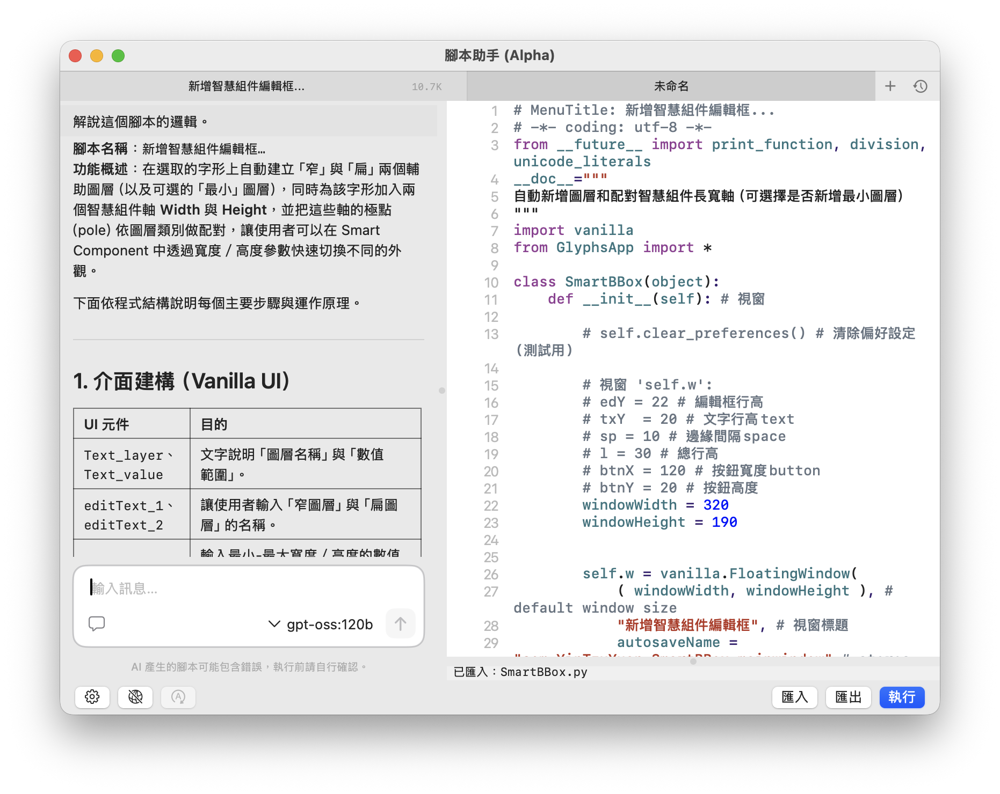

# ScriptMate — 腳本助手

Glyphs 3 的 AI 腳本助手外掛

透過自然語言描述需求，ScriptMate 為你生成、執行、修正 Glyphs Python 腳本。
無需記住 API 名稱，對話即開發。

> ⚠️ Alpha 內測版 — 歡迎回饋，功能和介面可能隨時變更

## 功能特色

- **三面板架構** — Chat（對話）、Code（即時編輯）、Output（執行結果）各司其職
- **三種模式**，用 `Shift+Tab` 快速切換：
  - 💬 **對話**（Chat）— 純問答模式。AI 搜尋 Glyphs API、解釋概念，不寫碼不執行
  - ⚡ **主控台**（Console）— AI 撰寫一次性腳本，自動執行並回傳結果。適合快速批次處理
  - 🪟 **視窗**（Window）— AI 作為 GUI 工具建造者，產出帶有 Vanilla 介面的互動工具視窗，可重複使用
- **BYOK** — 自帶 API key，支援任何 OpenAI 相容的 AI 服務
- **Glyphs API 即時搜尋** — AI 自動查詢 Python API 文件和 mekkablue 腳本庫

## 安裝

### Alpha 內測版

1. 從 [GitHub Releases](https://github.com/yintzuyuan/ScriptMate/releases) 下載最新的 `.glyphsPlugin` 檔案
2. 雙擊檔案安裝
3. 重新啟動 Glyphs 3
4. 在選單列 **Script → ScriptMate (Alpha)** 開啟

## 隱私須知

ScriptMate 使用 **BYOK**（Bring Your Own Key）模式——你的對話內容和腳本程式碼會直接傳送到你選擇的 AI 服務商（如 Ollama Cloud、Groq 等），ScriptMate 不經手也不儲存任何資料。

如果你的工作涉及未公開的字型設計或商業機密，建議使用**本地 Ollama**（見下方替代方案），所有資料完全留在你的電腦上。

## 快速開始：使用 Ollama Cloud（免費）

推薦從免費的 Ollama Cloud 開始：

### 1. 註冊 Ollama Cloud

1. 前往 [ollama.com](https://ollama.com) 點擊 Sign Up
2. 完成註冊後，進入 Dashboard
3. 在 API Keys 頁面建立一組新的 API key
4. 複製 key（只會顯示一次）

### 2. 設定 ScriptMate

1. 開啟 ScriptMate → 點擊工具列 ⚙️ 設定按鈕
2. 切換到「AI 服務」分頁
3. 點擊「+」新增服務，填入：
   - **類型**：選擇 `OpenAI 相容端點`
   - **端點**：輸入 `https://ollama.com/v1`
   - **API Key**：貼上你的 key（必填）
4. 點擊「擷取模型」載入可用模型列表
5. 選擇模型（推薦 `devstral-small-2:24b`）
6. 點擊「測試連線」確認成功 → 儲存

替代方案：本地 Ollama（離線使用）

如果你偏好在本機執行模型：

1. 安裝 [Ollama](https://ollama.com/download)
2. 在終端機下載模型：`ollama pull devstral-small-2:24b`
3. 在 ScriptMate 設定中：
   - **端點**：保持預設 `http://localhost:11434/v1`
   - **API Key**：留空
4. 點擊「擷取模型」→ 選擇模型 → 儲存

> 💡 本地執行需要足夠記憶體：24B 模型約需 16 GB RAM，更大模型需更多。

### 3. 開始使用

1. 在 Chat 面板輸入需求，例如：「把所有字符的錨點往上移 50 units」
2. AI 搜尋 API → 生成腳本到 Code 面板
3. 按 ▶ 執行，結果顯示在 Output 面板
4. 有錯誤？主控台模式會自動修正並重新執行

## 推薦模型

以下推薦基於 ScriptMate 的 benchmark 測試，評估 tool calling、API 搜尋、錯誤修正等實際能力。Benchmark 通過率反映標準化任務的表現，實際使用中複雜任務的成功率會較低。

### Ollama Cloud（免費）

| 模型 | 大小 | 通過率 | 說明 |
|------|------|--------|------|
| devstral-small-2:24b | 24B | 100% | 快速輕量，**首選推薦** |
| glm-5 | — | 96% | 智譜 AI 開發 |
| devstral-2:123b | 123B | 93% | 大模型品質 |
| nemotron-3-nano:30b | 30B | 84% | 輕量替代方案 |
| qwen3-next:80b | 80B | 84% | 穩定可靠 |

### Groq Cloud（有免費額度）

| 模型 | 通過率 | 說明 |
|------|--------|------|
| kimi-k2-instruct | 85% | T2 search+write 完美 |
| gpt-oss-120b | 85% | T1+T2 近乎完美 |

> 以上模型均可在 Ollama Cloud 或 Groq Cloud 的免費方案中使用。
>
### 使用付費商業模型

ScriptMate 支援任何 OpenAI 相容的 API，包括付費的商業模型服務：

- **OpenAI**（GPT-4o 等）、**DeepSeek**、**Mistral** — 直接填入官方 API 端點和 key
- **OpenRouter** — 單一帳號存取多家模型，包括 Anthropic Claude、Google Gemini 等非 OpenAI 相容的模型

設定方式與上方相同：在「AI 服務」中新增服務，填入對應的端點和 API key 即可。付費模型通常在複雜任務和長對話中表現更穩定。

## 使用情境

### 匯出腳本到 Glyphs Script 選單

滿意 AI 生成的腳本？可以匯出為獨立的 `.py` 檔，直接出現在 Glyphs 的 Script 選單中：

1. 在 Code 面板中確認腳本開頭有 `# MenuTitle: 你的腳本名稱`
2. 點擊底部工具列的「匯出」按鈕
3. 腳本會存到 `~/Library/Application Support/Glyphs 3/Scripts/ScriptMate/` 資料夾
4. 重新啟動 Glyphs，腳本就會出現在 Script → ScriptMate 子選單中

> 💡 可在設定中自訂腳本匯出資料夾路徑。

### 匯入現有腳本

想修改或改進已有的腳本？

1. 點擊底部工具列的「匯入」按鈕
2. 選擇 `.py` 檔案
3. 腳本內容載入到 Code 面板，AI 可以協助你理解或改進它

### 模式選擇建議

| 情境 | 推薦模式 |
|------|---------|
| 詢問 Glyphs API 用法 | 💬 對話 |
| 快速批次處理字符 | ⚡ 主控台 |
| 建立可重複使用的工具面板 | 🪟 視窗 |
| 不確定需求，先問再做 | 💬 對話 → ⚡ 主控台 |

## 系統需求

- macOS 14.0+
- Glyphs 3

## 回饋方式

- [GitHub Issues](https://github.com/yintzuyuan/ScriptMate/issues)

## 授權

Alpha 內測版免費使用。正式版定價與授權方式待公告。
